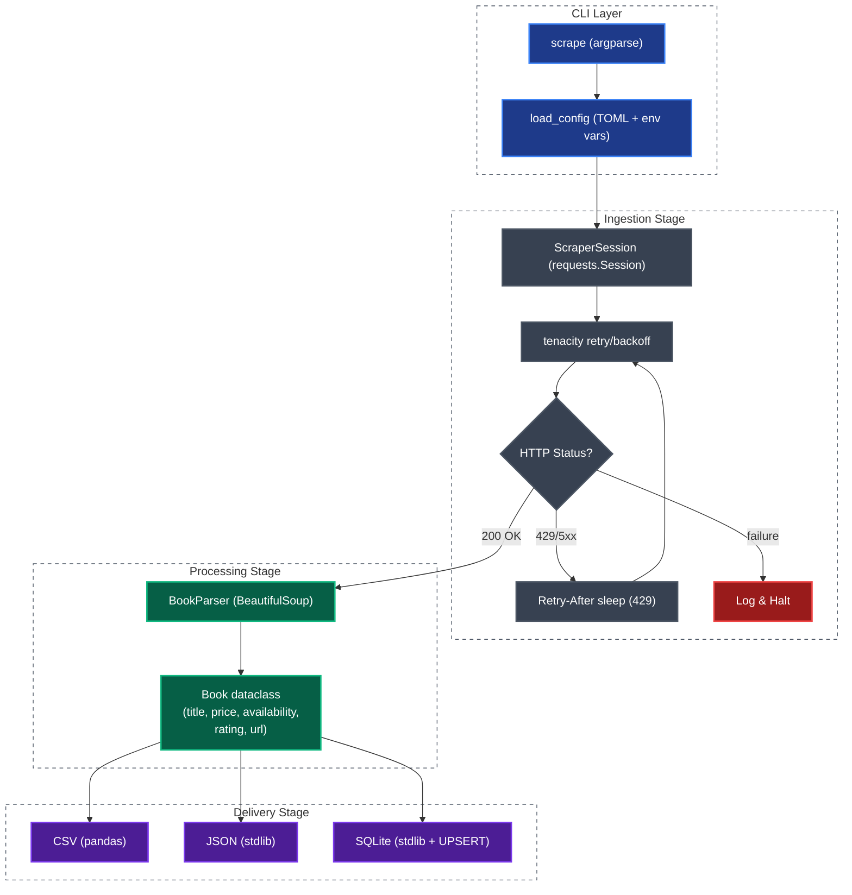

# Enterprise Web Scraper & Data Extractor

[](https://www.python.org/)
[](https://github.com/astral-sh/uv)
[](https://github.com/psf/black)
[](./tests/)
[](./pyproject.toml)

A production-ready Python web scraping pipeline showcasing reliable data extraction, retry/backoff resiliency, structured logging, a modular package architecture, a CLI, and multi-format data delivery (CSV, JSON, SQLite).

The project scrapes the public test website [Books to Scrape](http://books.toscrape.com/) to demonstrate a complete, end-to-end extraction workflow.

> 💼 **Need custom web scraping or data pipeline solutions?**
> I build resilient, automated data extraction engines tailored to business requirements (e-commerce, real estate, financial data, market research, and more).
> **Contact for Freelance / Contracts:** [matheusmourabr1@gmail.com](mailto:matheusmourabr1@gmail.com) | [LinkedIn](https://www.linkedin.com/in/matheus-moura-543180306/) | [Upwork](https://www.upwork.com/freelancers/~015a096ee372c9e094?mp_source=share)

---

## Key Features

- **Retry/Backoff with `tenacity`:** Exponential backoff with jitter on `429`, `500`, `502`, `503`, `504`. Respects `Retry-After` response headers.
- **CLI with `argparse`:** `scrape --max-pages 5 --formats csv json` — configure on the fly without touching code.
- **Config via TOML:** All scraper knobs in `config/default.toml`, overridable via environment variables (`SCRAPER_BASE_URL`, `SCRAPER_TIMEOUT`, etc.).
- **SQLite Persistence:** Idempotent `UPSERT` — run the scraper twice, no duplicate rows.
- **Rich Terminal Output:** Progress bar and summary table via `rich`. Auto-disables in non-TTY environments (CI/CD).
- **Modular Architecture:** Clean separation across `config`, `http_client`, `parser`, `exporters`, and `pipeline` modules.
- **Test Coverage:** 34 tests (parser, HTTP client, pipeline) using `pytest`, `responses`, and `pytest-mock`. Zero real HTTP calls.

---

## Tech Stack

| Technology | Purpose |
| :--- | :--- |
|  | Core application logic |
|  | Dependency and virtual environment management |
|  | HTTP client with persistent session reuse |
|  | Retry/backoff with exponential wait + jitter |
|  | Defensive HTML DOM parsing |
|  | CSV export and structured dataset handling |
|  | Terminal progress bar and formatted output |
|  | Persistent database storage (zero extra dependencies) |
|  | Test suite with HTTP mocking |

---

## Architecture

```
src/enterprise_web_scraper/
├── __init__.py       # Package version
├── cli.py            # CLI entry point (argparse + rich)
├── config.py         # TOML config loader with env var overrides
├── http_client.py    # ScraperSession: requests + tenacity retry
├── parser.py         # BookParser: BeautifulSoup + Book dataclass
├── exporters.py      # CSV / JSON / SQLite exporters
└── pipeline.py       # ScraperPipeline: orchestrates everything
```

### Scraping Pipeline



---

## Quick Start

### Prerequisites
- Python 3.11+
- [`uv`](https://github.com/astral-sh/uv) installed

### Running the Pipeline

```bash
# 1. Clone the repository
git clone https://github.com/moura07/enterprise-web-scraper.git
cd enterprise-web-scraper

# 2. Install dependencies
uv sync

# 3. Run with defaults (all 50 pages → CSV + JSON + SQLite)
uv run scrape

# 4. Or limit to 5 pages and only CSV output
uv run scrape --max-pages 5 --formats csv
```

---

## CLI Reference

```
usage: scrape [-h] [--version] [--config PATH] [--max-pages N]
              [--formats {csv,json,sqlite} ...] [--no-progress] [-v]

Options:
  --config PATH         Path to a custom TOML config file
  --max-pages N         Maximum pages to scrape (0 = no limit)
  --formats FMT [...]   Output formats: csv, json, sqlite
  --no-progress         Disable progress bar (useful in CI)
  -v, --verbose         Enable DEBUG-level logging
  --version             Print version and exit
```

### Examples

```bash
uv run scrape                                  # defaults from config/default.toml
uv run scrape --max-pages 2                    # quick test — only 2 pages
uv run scrape --formats sqlite                 # SQLite only
uv run scrape --config config/custom.toml      # custom config
uv run scrape --no-progress -v                 # CI mode with debug logs
SCRAPER_MAX_PAGES=3 uv run scrape              # env var override
```

---

## Configuration

Edit `config/default.toml` to tune the scraper without touching code:

```toml
[scraper]
base_url = "http://books.toscrape.com/"
timeout = 10
max_pages = 0                    # 0 = scrape all pages
delay_between_requests = 0.5     # polite delay between requests

[retry]
max_attempts = 3
wait_min = 1.0
wait_max = 10.0
jitter = true
retry_on_status = [429, 500, 502, 503, 504]

[output]
data_dir = "data"
formats = ["csv", "json", "sqlite"]
sqlite_db = "data/books.db"
```

### Environment Variable Overrides

All `[scraper]` settings can be overridden at runtime:

| Variable | Config equivalent |
| :--- | :--- |
| `SCRAPER_BASE_URL` | `scraper.base_url` |
| `SCRAPER_TIMEOUT` | `scraper.timeout` |
| `SCRAPER_MAX_PAGES` | `scraper.max_pages` |
| `SCRAPER_DELAY` | `scraper.delay_between_requests` |
| `SCRAPER_DATA_DIR` | `output.data_dir` |
| `SCRAPER_SQLITE_DB` | `output.sqlite_db` |

---

## Error Handling & Resiliency

| Failure scenario | Behaviour |
| :--- | :--- |
| Timeout | Caught, logged, retried up to `max_attempts` |
| `429 Too Many Requests` | Retried; `Retry-After` header respected |
| `500 / 502 / 503 / 504` | Retried with exponential backoff + jitter |
| `404 Not Found` | Not retried; logged and returns `None` |
| Page fetch failure | Pagination stops; already-scraped data is exported |
| Missing HTML attribute | Fallback values: `"Unknown Title"`, `"Unknown Price"`, `"no"` |

---

## Output Schema

Each extracted record conforms to the `Book` dataclass:

| Field | Type | Description |
| :--- | :--- | :--- |
| `title` | `str` | Full title of the book |
| `price` | `str` | Price with currency symbol (e.g., `£51.77`) |
| `availability` | `str` | `yes` if in stock, otherwise `no` |
| `rating` | `int` | Star rating 1–5 (0 if unparseable) |
| `url` | `str` | Absolute URL to the book's detail page |

### Example JSON Record

```json
{
    "title": "A Light in the Attic",
    "price": "£51.77",
    "availability": "yes",
    "rating": 3,
    "url": "http://books.toscrape.com/catalogue/a-light-in-the-attic_1000/index.html"
}
```

### SQLite Schema

```sql
CREATE TABLE books (
    title        TEXT PRIMARY KEY,
    price        TEXT NOT NULL,
    availability TEXT NOT NULL,
    rating       INTEGER NOT NULL DEFAULT 0,
    url          TEXT NOT NULL DEFAULT ''
);
```

---

## Running Tests

```bash
# Install dev dependencies
uv sync

# Run full test suite
uv run pytest

# With verbose output
uv run pytest -v --tb=short
```

**34 tests** across 3 modules — zero real HTTP calls (all mocked with `responses`):

| Module | Tests | Coverage |
| :--- | :--- | :--- |
| `test_parser.py` | 17 | Parsing, fallbacks, ratings, pagination |
| `test_http_client.py` | 9 | Retry, 429/5xx, Retry-After, timeout, encoding |
| `test_pipeline.py` | 8 | End-to-end, file creation, max_pages, idempotency |