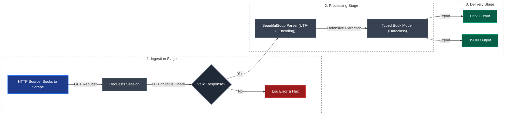

# Enterprise Web Scraper & Data Extractor

A production-ready Python web scraping pipeline designed to showcase reliable data extraction, defensive HTML parsing, structured logging, and multi-format data delivery.

The project scrapes the public test website [Books to Scrape](http://books.toscrape.com/) to demonstrate a complete, end-to-end extraction workflow, saving normalized data into CSV and JSON formats.

> 💼 **Need custom web scraping or data pipeline solutions?**  
> I build resilient, automated data extraction engines tailored to business requirements (e-commerce, real estate, financial data, market research, and more).  
> **Contact for Freelance / Contracts:** [matheusmourabr1@gmail.com](mailto:matheusmourabr1@gmail.com) | [LinkedIn](https://www.linkedin.com/in/matheus-moura-543180306/) | [Upwork](https://www.upwork.com/freelancers/~015a096ee372c9e094?mp_source=share)

---

## Key Features

- **Robust Error Handling:** Timeout management, HTTP error handling, and graceful fallback values for missing attributes.
- **Enterprise Design Patterns:** Object-oriented architecture, typed data models (`dataclasses`), and structural logging (no `print` debugging).
- **Automated Pagination:** Dynamic page navigation across all 50 pages with deterministic dataset generation.
- **Modern Package Management:** Built and managed with `uv` for high-performance dependency isolation.

---

## Tech Stack

| Technology | Purpose |
| :--- | :--- |
| **Python 3.10+** | Core application logic |
| **`uv`** | Fast dependency and virtual environment management |
| **Requests** | Robust HTTP client execution with session reuse |
| **BeautifulSoup 4** | Defensive HTML DOM parsing |
| **Pandas** | CSV processing and structured dataset export |

---

## Design & Architecture

The scraper follows a structured ingestion pipeline:



The implementation intentionally keeps extraction, transformation, and delivery responsibilities separated (Separation of Concerns). This makes the project highly extensible.

### Future Extensibility Opportunities:
- Retry policies (e.g., using `tenacity` or custom session mounting)
- Rate limiting and random delays (anti-scraping bypass)
- Proxy integration and User-Agent rotation
- Schema validation (e.g., using `pydantic`)
- Database persistence (PostgreSQL, SQLite, etc.)
- Cloud storage uploads (AWS S3, GCP Cloud Storage)
- Unit and integration testing with `pytest`
- Orchestration via Apache Airflow, Prefect, or cron jobs

---

## Error Handling & Resiliency

The scraper is designed to be resilient and fail gracefully under typical scraping hazards:

- **Network Faults:** Connection failures and timeouts are caught, logged, and handled.
- **Graceful Degradation:** Page-level network failures halt the pagination loop gracefully without discarding already scraped data.
- **Defensive Parsing:** If individual attributes are missing or structured differently, fallback values are utilized instead of throwing exceptions:
  - Missing title: `"Unknown Title"`
  - Missing price: `"Unknown Price"`
  - Missing availability: `"no"`
- **Directory Verification:** Automatically checks and creates target output folders before writing files.

---

## Output Schema

Each extracted record is structured according to the following schema:

| Field | Type | Description |
| :--- | :--- | :--- |
| `title` | string | Full title of the book |
| `price` | string | Book price, correctly decoded with currency symbol (e.g., `£51.77`) |
| `availability` | string | `yes` if in stock, otherwise `no` |

### Example JSON Record:

```json
{
    "title": "A Light in the Attic",
    "price": "£51.77",
    "availability": "yes"
}
```

---

## Quick Start (Local Setup)

### Prerequisites
- Python 3.10+
- [`uv`](https://github.com/astral-sh/uv) installed

### Running the Pipeline

```bash
# 1. Clone the repository
git clone https://github.com/moura07/enterprise-web-scraper.git
cd enterprise-web-scraper

# 2. Run the pipeline (uv will automatically bootstrap the virtual environment)
uv run python src/scraper.py
```